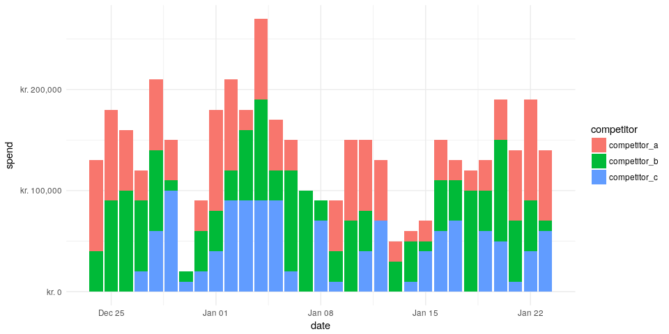
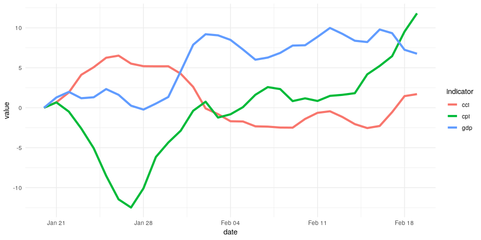
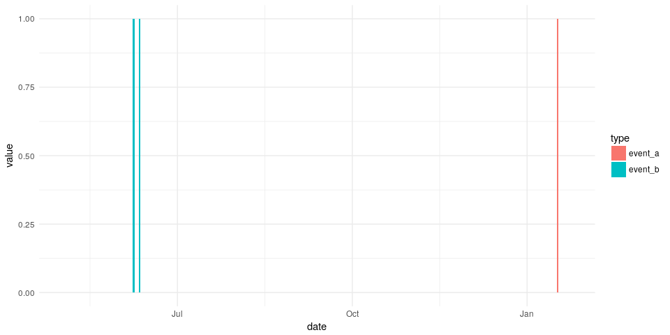
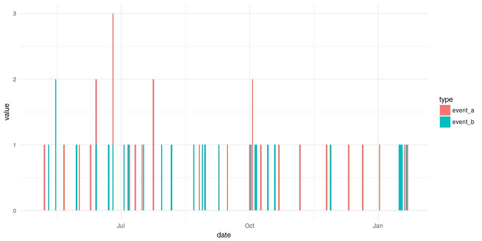
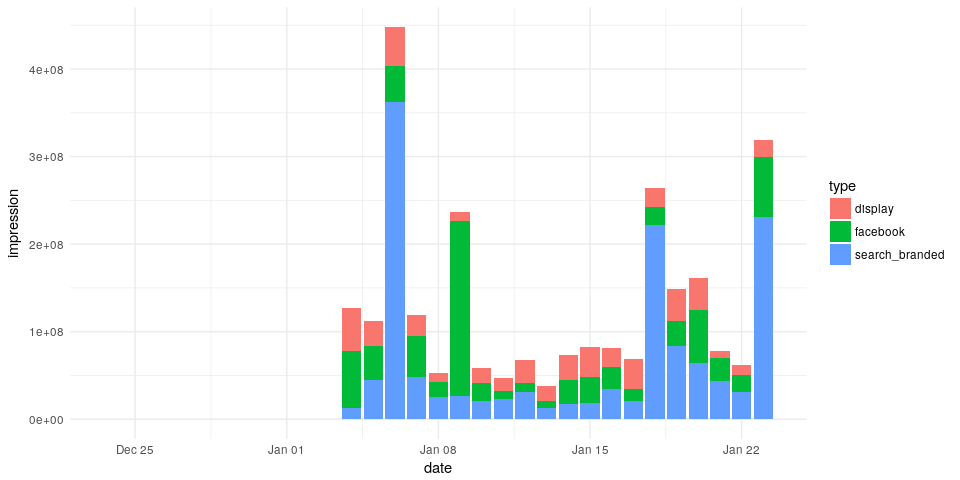

<!-- README.md is generated from README.Rmd. Please edit that file -->
dammmdatagen
============

The goal of dammmdatagen is to make it easy for marketing mix modeling professionals to get access to realistic data sets where the ground truth is known. This fascilitates our development and provides in the end more value for all stakeholders of MMM.

Build status etc
----------------

[](https://travis-ci.org/DoktorMike/dammmdatagen) [](https://codecov.io/github/DoktorMike/dammmdatagen?branch=master)

Installation
------------

You can install dammmdatagen from github with:

``` r
# install.packages("devtools")
devtools::install_github("DoktorMike/dammmdatagen")
```

Quick start
-----------

This is a basic example which shows you how to generate a small 1 year data set.

``` r
# load useful libraries
library(dammmdatagen)

# generate a basic data set
mydf <- generateData()
head(mydf)
#> # A tibble: 6 x 10
#>   date       sunshine precipi… tempe… compet… compet… compet…   cpi    cci
#>   <date>        <dbl>    <dbl>  <dbl>   <dbl>   <dbl>   <dbl> <dbl>  <dbl>
#> 1 2017-01-14  -2.50     -1.10  -2.64    50000   30000  100000  0     0    
#> 2 2017-01-15  -0.253     0.178 -2.14    10000   70000       0  1.87 -0.497
#> 3 2017-01-16  -0.340    -0.758 -1.72    60000   90000   50000  5.51  0.184
#> 4 2017-01-17  -0.399    -1.36  -0.746   50000  100000   50000  8.34  1.31 
#> 5 2017-01-18   0.0712   -1.10  -0.981   40000  100000   50000  9.13  3.81 
#> 6 2017-01-19   0.308    -1.79  -0.161  100000  100000       0 10.0   4.45 
#> # ... with 1 more variable: gdp <dbl>
```

We can do a lot more of course! In this small snippet we'll generate 1 month worth of competitor media spendings data and plot that out.

``` r
library(dammmdatagen)
library(ggplot2)
library(dplyr)
library(tidyr)
library(scales) 

generateCompetitorData(fromDate = Sys.Date()-30, toDate = Sys.Date()) %>% 
  gather("competitor", "spend", -"date") %>% 
  ggplot(aes(y=spend, x=date, fill=competitor)) + 
  geom_bar(stat="identity", position = position_stack()) + 
  theme_minimal() + scale_y_continuous(labels = dollar_format(prefix = "kr. "))
```



Just as we can generate competitor spending data we can also generate macroeconomical data. These types of indicators are typically slow moving over time with minor temporal differences.

``` r
generateMacroData(fromDate = Sys.Date()-30, toDate = Sys.Date()) %>% 
  gather("indicator", "value", -"date") %>% 
  ggplot(aes(y=value, x=date, color=indicator)) + 
  geom_line(size = 1.5) + theme_minimal()
```



Event type data
---------------

Event data are modeled as a poisson distribution with a low incidence.

``` r
generateEventData(Sys.Date()-265, Sys.Date()) %>%
  gather(type, value, -date) %>%
  ggplot(aes(y=value, x=date, fill=type)) +
  geom_bar(stat="identity") + theme_minimal()
```



The incidence can of course be controlled. This is done via the freq parameter.

``` r
generateEventData(Sys.Date()-265, Sys.Date(), freq = 0.1) %>%
  gather(type, value, -date) %>%
  ggplot(aes(y=value, x=date, fill=type)) +
  geom_bar(stat="identity") + theme_minimal()
```



Media generation
----------------

Generating media is in general a bit more complicated as we need more information since in MMM models that's what we primarily care about. So we need three data.frames; the net, the impressions and the cpms. We also differentiate between offline and online media. This difference is rather artificial right now but it's to futureproof the package.

``` r
mydflist <- generateOnlineData(Sys.Date()-30, Sys.Date())
mydflist[["impression"]] %>%
  gather(type, impression, -date) %>%
  ggplot(aes(y=impression, x=date, fill=type)) +
  geom_bar(stat="identity") + theme_minimal()
```


