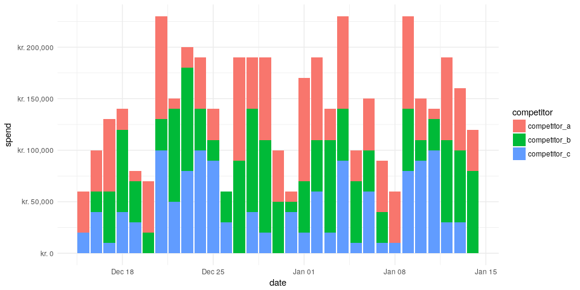
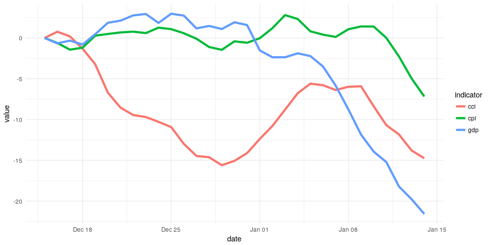

<!-- README.md is generated from README.Rmd. Please edit that file -->
dammmdatagen
============

The goal of dammmdatagen is to make it easy for marketing mix modeling professionals to get access to realistic data sets where the ground truth is known. This fascilitates our development and provides in the end more value for all stakeholders of MMM.

Build status etc
----------------

[](https://travis-ci.org/DoktorMike/dammmdatagen)

Installation
------------

You can install dammmdatagen from github with:

``` r
# install.packages("devtools")
devtools::install_github("DoktorMike/dammmdatagen")
```

Quick start
-----------

This is a basic example which shows you how to generate a small 1 year data set.

``` r
# load useful libraries
library(dammmdatagen)

# generate a basic data set
mydf <- generateData()
head(mydf)
#> # A tibble: 6 x 10
#>   date       sunshine precip… temper… comp… comp… comp…   cpi    cci   gdp
#>   <date>        <dbl>   <dbl>   <dbl> <dbl> <dbl> <dbl> <dbl>  <dbl> <dbl>
#> 1 2017-01-14    1.63    0.852  0.717      0 20000 60000  0     0     0    
#> 2 2017-01-15    1.21    1.66   0.545  30000 30000 40000  2.68 -0.798 0.147
#> 3 2017-01-16    0.561   1.15  -0.632      0 70000 70000  4.54 -2.69  1.64 
#> 4 2017-01-17   -1.58   -0.334  1.22   50000 70000     0  7.89 -4.51  2.36 
#> 5 2017-01-18   -0.491   1.42  -0.0889 60000 50000     0 10.7  -5.89  2.70 
#> 6 2017-01-19    0.933   0.565 -0.194  30000 50000 50000 12.4  -7.15  2.60
```

We can do a lot more of course! In this small snippet we'll generate 1 month worth of competitor media spendings data and plot that out.

``` r
library(dammmdatagen)
library(ggplot2)
library(dplyr)
library(tidyr)
library(scales)

generateCompetitorData(fromDate = Sys.Date()-30, toDate = Sys.Date()) %>% 
  gather("competitor", "spend", -"date") %>% 
  ggplot(aes(y=spend, x=date, fill=competitor)) + 
  geom_bar(stat="identity", position = position_stack()) + 
  theme_minimal() + scale_y_continuous(labels = dollar_format(prefix = "kr. "))
```



Just as we can generate competitor spending data we can also generate macroeconomical data. These types of indicators are typically slow moving over time with minor temporal differences.

``` r
generateMacroData(fromDate = Sys.Date()-30, toDate = Sys.Date()) %>% 
  gather("indicator", "value", -"date") %>% 
  ggplot(aes(y=value, x=date, color=indicator)) + 
  geom_line(size = 1.5) + theme_minimal()
```


