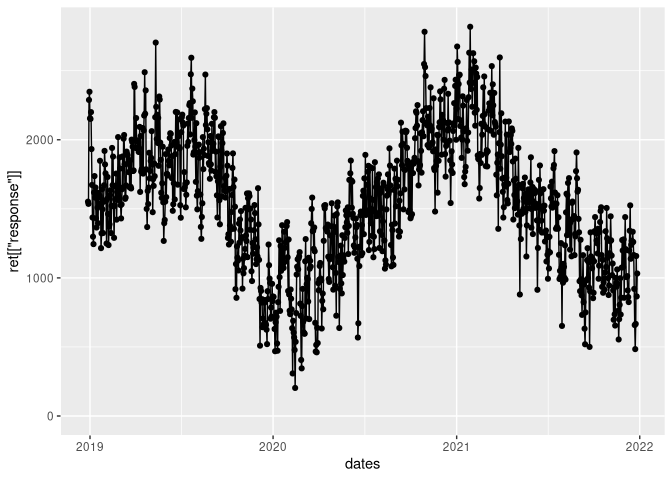
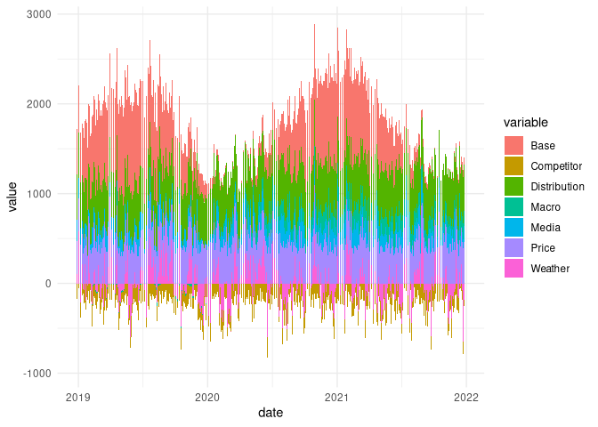
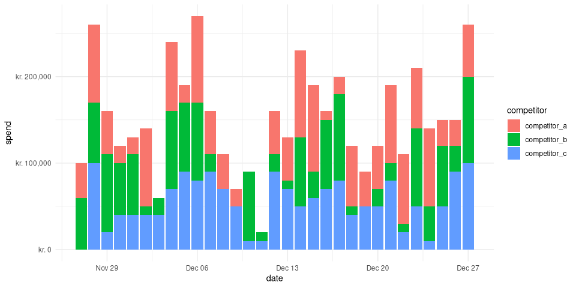
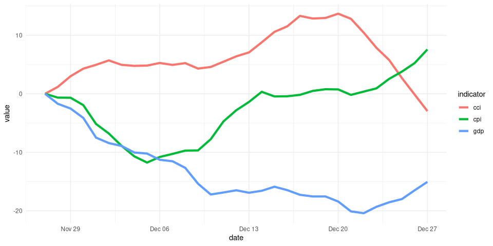
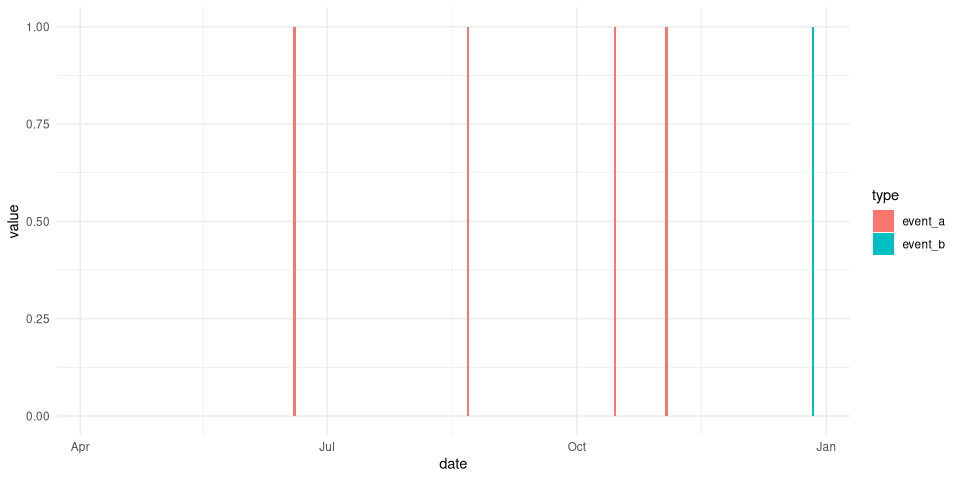
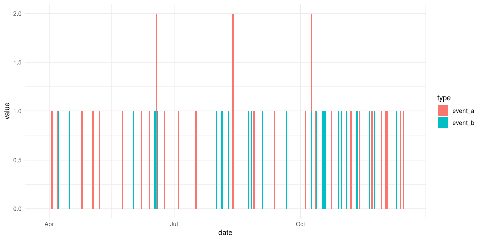
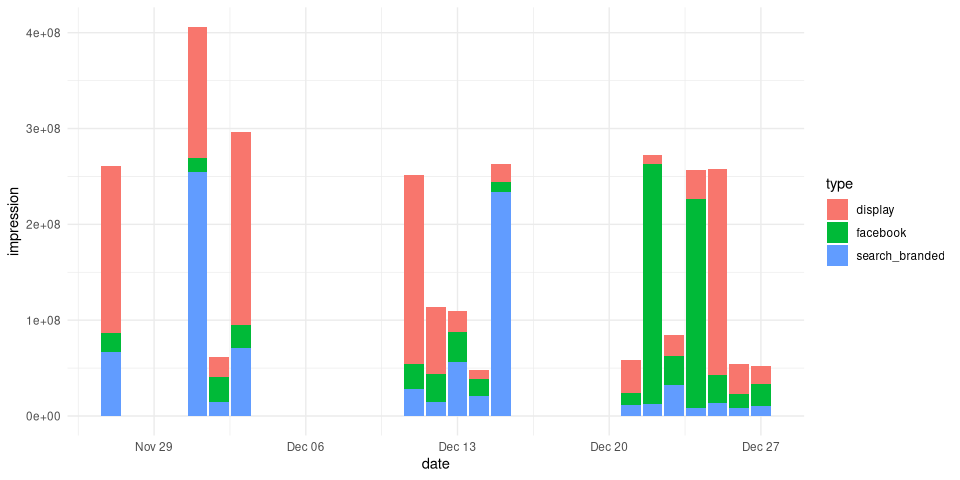

<!-- README.md is generated from README.Rmd. Please edit that file -->

# dammmdatagen <a href="https://doktormike.github.io/dammmdatagen/"></a>

The goal of dammmdatagen is to make it easy for marketing mix modeling
professionals to get access to realistic data sets where the ground
truth is known. This fascilitates our development and provides in the
end more value for all stakeholders of MMM.

## Build status etc

<!-- badges: start -->

[](https://lifecycle.r-lib.org/articles/stages.html#experimental)
[](https://github.com/DoktorMike/dammmdatagen/actions)
[](https://app.codecov.io/gh/DoktorMike/dammmdatagen?branch=master)
<!-- badges: end -->

## Installation

You can install dammmdatagen from github with:

``` r
# install.packages("devtools")
devtools::install_github("DoktorMike/dammmdatagen")
```

## Quick start

This is a basic example which shows you how to generate a small 1 year
data set.

``` r
# load useful libraries
library(dammmdatagen)

# generate a basic data set
mydf <- generateCovariatesData()
#> Joining, by = "date"
#> Joining, by = "date"
#> Joining, by = "date"
head(mydf)
#> # A tibble: 6 × 37
#>   date       sunshine precipitation temperature competitor_a competitor_b
#>   <date>        <dbl>         <dbl>       <dbl>        <dbl>        <dbl>
#> 1 2020-12-18 -0.729          -1.66        0.118        60000        20000
#> 2 2020-12-19 -0.197          -1.87        0.322       100000        40000
#> 3 2020-12-20  1.04           -1.37       -1.27         40000            0
#> 4 2020-12-21  0.157           0.457       0.231        50000        10000
#> 5 2020-12-22  0.00165         1.70        1.55         40000        90000
#> 6 2020-12-23 -0.311           0.995       0.719        10000        60000
#> # … with 31 more variables: competitor_c <dbl>, cpi <dbl>, cci <dbl>,
#> #   gdp <dbl>, dist_product_a <dbl>, dist_product_b <dbl>,
#> #   dist_product_c <dbl>, price_product_a <dbl>, price_product_b <dbl>,
#> #   price_product_c <dbl>, net_display <dbl>, net_facebook <dbl>,
#> #   net_search_branded <dbl>, net_tv <dbl>, net_radio <dbl>, net_ooh <dbl>,
#> #   net_print <dbl>, imp_display <dbl>, imp_facebook <dbl>,
#> #   imp_search_branded <dbl>, imp_tv <dbl>, imp_radio <dbl>, imp_ooh <dbl>, …
```

Say that you would like to also generate a response variable to fit a
model to. Then you could use the highlevel API function below.

``` r
library(dammmdatagen)
library(ggplot2)
library(dplyr)
library(tidyr)
library(scales)
ret <- generateRetailData()
#> Joining, by = "date"
#> Joining, by = "date"
#> Joining, by = "date"
#> New names:
#> * product_a -> product_a...7
#> * product_b -> product_b...8
#> * product_c -> product_c...9
#> * product_a -> product_a...10
#> * product_b -> product_b...11
#> * ...
dates <- ret[["covariates"]][["Macro"]][["date"]]
qplot(dates, ret[["response"]]) + geom_line() + ylim(0, NA)
```



``` r
# entrytocolname <- function(x) a <- ret[["effects"]][[x]] %>% setNames(c(tolower(paste0(x, "_", names(.)))))
entrytocolname <- function(x) tibble::tibble(rowSums(ret[["effects"]][[x]])) %>% setNames(x)
Reduce(dplyr::bind_cols, lapply(names(ret[["effects"]]), entrytocolname)) %>%
        dplyr::mutate(date = dates) %>%
        tidyr::pivot_longer(-date, names_to = "variable", values_to = "value") %>%
        ggplot2::ggplot(ggplot2::aes(x = date, y = value, fill = variable)) +
    ggplot2::geom_bar(stat = "identity") + ggplot2::theme_minimal() +
    ggplot2::ylab("Units sold") +
    ggplot2::xlab("")
```



We can do a lot more of course! In this small snippet we’ll generate 1
month worth of competitor media spendings data and plot that out.

``` r
library(dammmdatagen)
library(ggplot2)
library(dplyr)
library(tidyr)
library(scales)

generateCompetitorData(fromDate = Sys.Date() - 30, toDate = Sys.Date()) %>%
        gather("competitor", "spend", -"date") %>%
        ggplot(aes(y = spend, x = date, fill = competitor)) +
        geom_bar(stat = "identity", position = position_stack()) +
        theme_minimal() +
        scale_y_continuous(labels = dollar_format(prefix = "kr. "))
```



Just as we can generate competitor spending data we can also generate
macroeconomical data. These types of indicators are typically slow
moving over time with minor temporal differences.

``` r
generateMacroData(fromDate = Sys.Date() - 30, toDate = Sys.Date()) %>%
        gather("indicator", "value", -"date") %>%
        ggplot(aes(y = value, x = date, color = indicator)) +
        geom_line(size = 1.5) +
        theme_minimal()
```



## Event type data

Event data are modeled as a poisson distribution with a low incidence.

``` r
generateEventData(Sys.Date() - 265, Sys.Date()) %>%
        gather(type, value, -date) %>%
        ggplot(aes(y = value, x = date, fill = type)) +
        geom_bar(stat = "identity") +
        theme_minimal()
```



The incidence can of course be controlled. This is done via the freq
parameter.

``` r
generateEventData(Sys.Date() - 265, Sys.Date(), freq = 0.1) %>%
        gather(type, value, -date) %>%
        ggplot(aes(y = value, x = date, fill = type)) +
        geom_bar(stat = "identity") +
        theme_minimal()
```



## Media generation

Generating media is in general a bit more complicated as we need more
information since in MMM models that’s what we primarily care about. So
we need three data.frames; the net, the impressions and the cpms. We
also differentiate between offline and online media. This difference is
rather artificial right now but it’s to futureproof the package.

``` r
mydflist <- generateOnlineData(Sys.Date() - 30, Sys.Date())
mydflist[["impression"]] %>%
        gather(type, impression, -date) %>%
        ggplot(aes(y = impression, x = date, fill = type)) +
        geom_bar(stat = "identity") +
        theme_minimal()
```



## Code of Conduct

Please note that the dammmdatagen project is released with a
[Contributor Code of
Conduct](https://doktormike.github.io/dammmdatagen/CODE_OF_CONDUCT.html).
By contributing to this project, you agree to abide by its terms.
